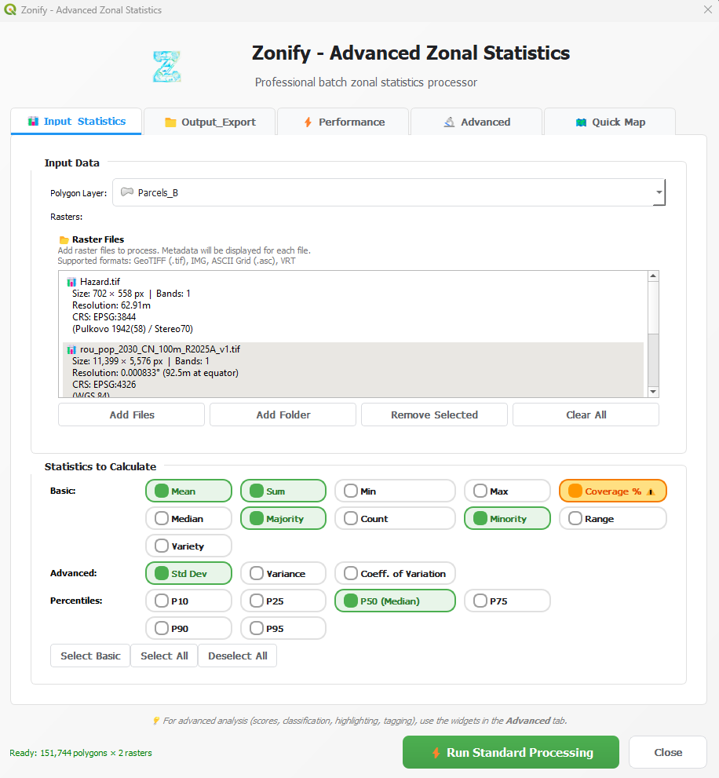
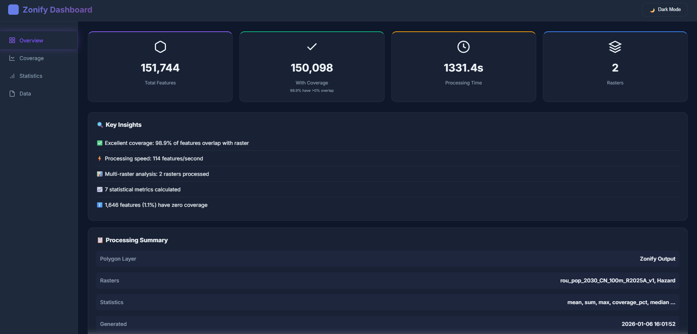
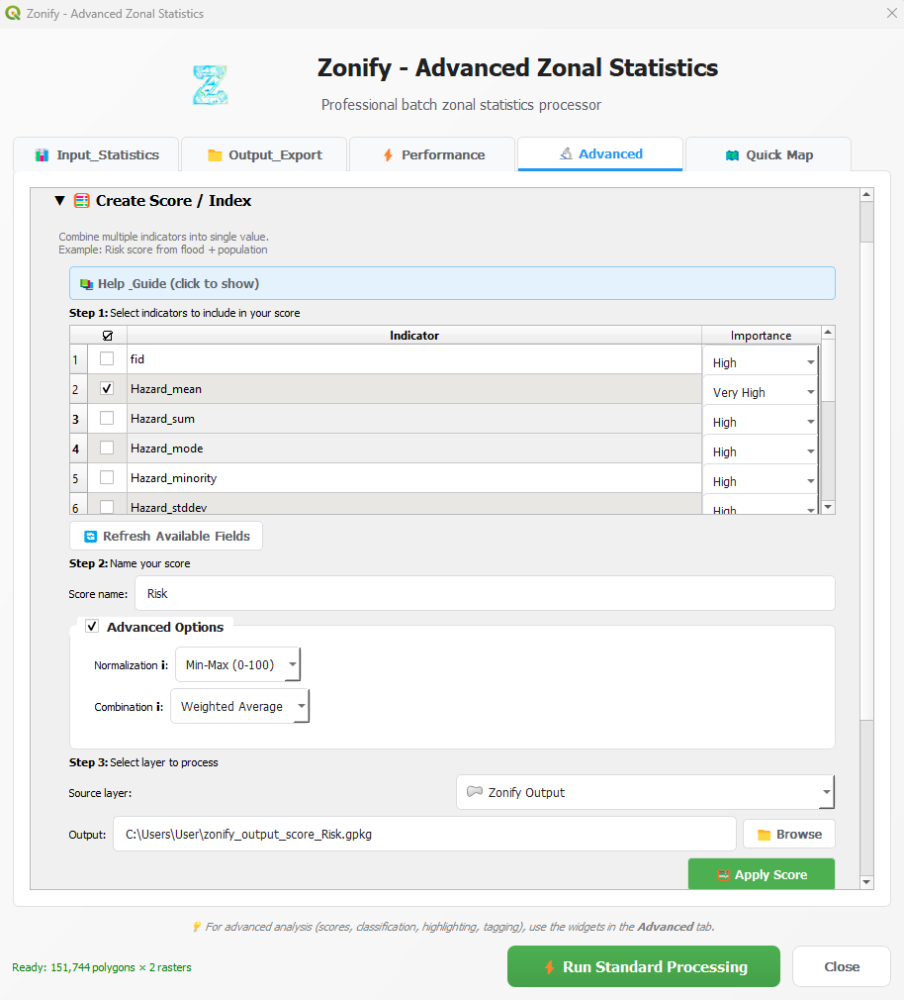

# Zonify

<div align="center">


**Advanced Zonal Statistics Processor for QGIS**
[](https://plugins.qgis.org/plugins/Zonify/)
[](https://github.com/dragosgontariu/zonify/releases)
[](LICENSE)
[](https://qgis.org)
[](https://www.python.org/)

[Features](#features) • [Installation](#installation) • [Quick Start](#quick-start) • [Documentation](#documentation) • [Support](#support)

</div>

---
🎉 **Now officially available on QGIS Plugin Repository!**

📖 **Website:** https://dragosgontariu.github.io/zonify  
🔗 **Plugin Page:** https://plugins.qgis.org/plugins/Zonify/
## 📸 Screenshots

### Main Interface


### Interactive HTML Dashboard


### Advanced Features


---

## ✨ Features

### Core Processing
- **🔄 Batch Processing**: Process unlimited rasters against polygon layers in one run
- **📊 15+ Statistics**: Mean, median, sum, min, max, std dev, CV, percentiles, and more
- **🎯 Pixel-Perfect Accuracy**: Geometric coverage calculation with ALL_TOUCHED mode
- **⚡ Smart Performance**: Multi-threaded processing with user-controlled RAM/CPU limits
- **💾 Resume Capability**: Checkpoint system allows resuming interrupted jobs
- **🚀 Background Processing**: Keep QGIS fully responsive during long operations

### Advanced Features
- **🏆 Score Creator**: Combine multiple indicators with weighted importance levels
- **🎨 Area Classifier**: Classify continuous values into categories
  - Equal Intervals
  - Quantiles
  - Natural Breaks (Jenks)
  - Custom breakpoints
- **🔍 Area Highlighter**: Identify top/bottom performing areas based on criteria
- **🏷️ Rule Tagger**: Apply complex rules with AND/OR logic
- **🗺️ Quick Map**: Generate professional maps with legend, scale bar, north arrow
- **📈 Time Series Analysis**: Temporal trend detection and change analysis

### Export Formats
- **📦 GeoPackage** (.gpkg) - Primary output with all attributes
- **📄 CSV** - Tabular data export
- **🔗 JSON** - Structured data for APIs
- **📊 HTML** - Interactive dashboards with charts and dark/light mode
- **📑 PDF** - Professional reports ready for printing

### HTML Dashboard Features
- Interactive Plotly charts
- Responsive design for all screen sizes
- Dark/Light mode toggle
- Pagination for large datasets (100 entries/page)
- Search and filter functionality
- Coverage analysis with visual breakdowns
- Statistics visualization per raster

---

## 📥 Installation

### From QGIS Plugin Repository (Recommended)

*Coming soon!*

1. Open QGIS
2. Go to **Plugins** → **Manage and Install Plugins**
3. Search for "**Zonify**"
4. Click **Install Plugin**
5. Dependencies will be installed automatically on first run

### Manual Installation

#### Windows

1. **Download the plugin:**
   - Download latest release from [GitHub](https://github.com/dragosgontariu/zonify/releases)
   - Extract `Zonify.zip`

2. **Copy to QGIS plugins directory:**
```
   C:\Users\<username>\AppData\Roaming\QGIS\QGIS3\profiles\default\python\plugins\Zonify
```

3. **Install Python dependencies:**
   - Open **OSGeo4W Shell** as Administrator
```bash
   pip install numpy pandas scipy matplotlib plotly reportlab jinja2 psutil pyarrow
```

4. **Enable the plugin:**
   - Restart QGIS
   - Go to **Plugins** → **Manage and Install Plugins**
   - Find "Zonify" and check the box

#### Linux (Ubuntu/Debian)

1. **Install QGIS** (if not already installed):
```bash
   sudo apt update
   sudo apt install qgis qgis-plugin-grass
```

2. **Copy plugin:**
```bash
   mkdir -p ~/.local/share/QGIS/QGIS3/profiles/default/python/plugins
   cp -r Zonify ~/.local/share/QGIS/QGIS3/profiles/default/python/plugins/
```

3. **Install dependencies:**
```bash
   pip3 install --user numpy pandas scipy matplotlib plotly reportlab jinja2 psutil pyarrow
```

4. **Enable in QGIS** (same as Windows)

#### macOS

1. **Copy plugin:**
```bash
   cp -r Zonify ~/Library/Application\ Support/QGIS/QGIS3/profiles/default/python/plugins/
```

2. **Install dependencies:**
```bash
   /Applications/QGIS.app/Contents/MacOS/bin/pip3 install numpy pandas scipy matplotlib plotly reportlab jinja2 psutil pyarrow
```

3. **Enable in QGIS** (same as Windows)

---

## 🚀 Quick Start

### Basic Workflow

1. **Open Zonify:**
   - Click the Zonify icon in toolbar
   - Or go to **Plugins** → **Zonify**

2. **Select Input Data:**
   - **Polygon Layer**: Choose your zones/regions layer
   - **Add Rasters**: Click "Add Raster(s)" and select one or more raster files

3. **Choose Statistics:**
   - Check the statistics you want to calculate
   - Common choices: Mean, Sum, Min, Max, Std Dev

4. **Configure Output:**
   - Set output file path (GeoPackage recommended)
   - Choose export formats (CSV, HTML, PDF)

5. **Run Processing:**
   - Click "Run Processing"
   - Monitor progress
   - Processing runs in background - QGIS stays responsive!

6. **View Results:**
   - Output layer automatically added to QGIS
   - Open attribute table to see calculated statistics
   - View HTML dashboard in browser
   - Check PDF report

### Example Use Cases

#### 🌊 Flood Risk Assessment
```
Input: City districts (polygons)
Rasters: Elevation, Flood zones, Population density
Statistics: Mean elevation, Sum population, Coverage by flood zones
Output: Risk score per district
```

#### 🌳 Forest Monitoring
```
Input: Forest parcels (polygons)
Rasters: NDVI time series (monthly for 2 years)
Statistics: Mean NDVI, Temporal change analysis
Output: Deforestation detection
```

#### 🏙️ Urban Accessibility
```
Input: Neighborhoods (polygons)
Rasters: Travel time to hospitals, schools, parks
Statistics: Mean travel time, Min distance
Output: Accessibility score per neighborhood
```

---

## 📚 Documentation

- **[User Guide](docs/USER_GUIDE.md)** - Comprehensive manual *(coming soon)*
- **[Quick Start](docs/QUICK_START.md)** - 5-minute tutorial *(coming soon)*
- **[FAQ](docs/FAQ.md)** - Frequently asked questions *(coming soon)*
- **[API Documentation](docs/API.md)** - For developers *(coming soon)*

---

## 🔧 Troubleshooting

### Dependencies Won't Install

**Problem:** `pip install` fails with permission error

**Solution (Windows):**
```bash
# Open OSGeo4W Shell as Administrator
# Try with --user flag:
pip install --user numpy pandas scipy matplotlib plotly reportlab jinja2 psutil pyarrow
```

**Solution (Linux/Mac):**
```bash
pip3 install --user numpy pandas scipy matplotlib plotly reportlab jinja2 psutil pyarrow
```

### Plugin Doesn't Appear

**Problem:** Plugin installed but not visible in menu

**Solutions:**
1. Restart QGIS completely
2. Check **Plugins** → **Manage and Install Plugins** → **Installed** → Enable Zonify
3. Check Python console for errors: **Plugins** → **Python Console**

### Processing Crashes or Freezes

**Problem:** QGIS freezes during large processing jobs

**Solutions:**
1. Reduce RAM limit in plugin settings
2. Reduce number of CPU cores
3. Process fewer rasters at once
4. Close other applications

### "No module named 'numpy'" Error

**Problem:** Missing Python dependencies

**Solution:**
```bash
# Verify QGIS Python environment
# In QGIS Python Console:
import sys
print(sys.executable)

# Then install to that Python:
#  -m pip install numpy pandas scipy ...
```

---

## ❓ FAQ

**Q: How many rasters can I process at once?**  
A: Unlimited! Tested with 20+ rasters and 500,000+ polygons.

**Q: Does it work with different coordinate systems?**  
A: Yes! Plugin automatically handles CRS differences.

**Q: Can I resume if processing is interrupted?**  
A: Yes! Checkpoint system allows resuming from where it stopped.

**Q: How long does processing take?**  
A: Depends on data size. Example: 100,000 polygons × 10 rasters × 5 statistics ≈ 10-30 minutes on modern PC.

**Q: Can I run multiple instances?**  
A: Not recommended. Run one instance at a time for best performance.

**Q: Is there a size limit?**  
A: No hard limit. Tested successfully with 5GB+ rasters and 500K+ features.

---

## 🤝 Contributing

Contributions are welcome! Please read [CONTRIBUTING.md](CONTRIBUTING.md) for guidelines.

**Ways to contribute:**
- 🐛 Report bugs
- 💡 Suggest features
- 📖 Improve documentation
- 🔧 Submit pull requests
- ⭐ Star the project on GitHub!

---

## 📄 License

This project is licensed under the **GNU General Public License v3.0** - see the [LICENSE](LICENSE) file for details.

---

## 💬 Support

- **📫 Issues**: [GitHub Issues](https://github.com/dragosgontariu/zonify/issues)
- **💭 Discussions**: [GitHub Discussions](https://github.com/dragosgontariu/zonify/discussions)
- **📧 Email**: gontariudragos@gmail.com

---

## 🙏 Acknowledgments

Thanks to all contributors and testers who helped make Zonify better!

---

## 📊 Requirements

- **QGIS**: 3.28 or higher
- **Python**: 3.9 or higher
- **Dependencies**: See [requirements.txt](requirements.txt)

---

<div align="center">

**⭐ If you find Zonify useful, please give it a star on GitHub! ⭐**

[Report Bug](https://github.com/dragosgontariu/zonify/issues) • [Request Feature](https://github.com/dragosgontariu/zonify/issues) • [Documentation](https://github.com/dragosgontariu/zonify#documentation)

</div>
```

---
