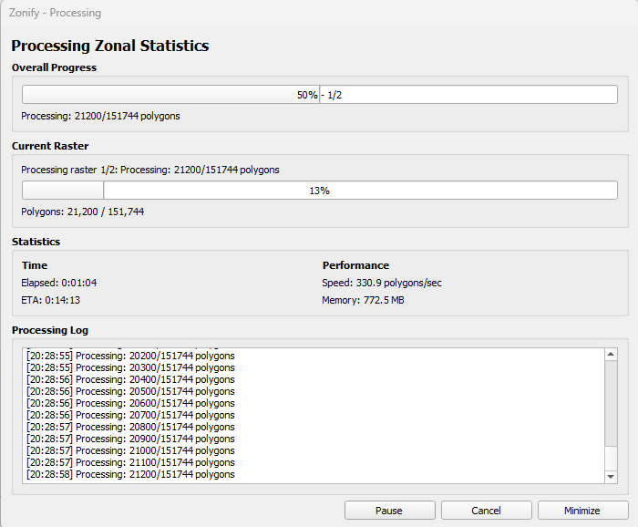
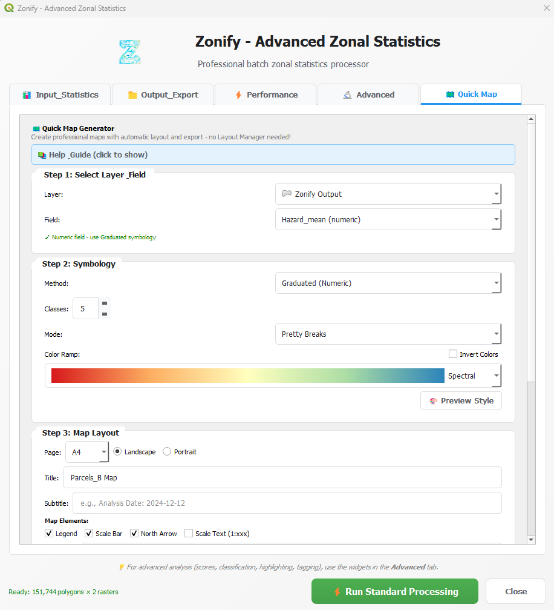

# Zonify - Quick Start Guide

Get started with Zonify in 5 minutes! This guide covers the basic workflow from loading data to viewing results.

---

## 📋 What You'll Need

Before starting:
- ✅ QGIS 3.28 or higher installed
- ✅ Zonify plugin installed and enabled
- ✅ A polygon layer (zones/regions)
- ✅ At least one raster file

---

## 🚀 5-Minute Tutorial

### Step 1: Open Zonify (10 seconds)

**Option A:** Click the Zonify icon in the toolbar  
**Option B:** Go to **Plugins** → **Zonify**


---

### Step 2: Load Your Data (1 minute)

#### Select Polygon Layer

1. Click the **Polygon Layer** dropdown
2. Select your zones layer (e.g., districts, parcels, grid)
3. The layer must have polygon geometries

**Tip:** If your layer isn't in the list, make sure it's loaded in QGIS first!

#### Add Rasters

1. Click **"Add Raster(s)"** button
2. Navigate to your raster files
3. Select one or more rasters (use Ctrl+Click for multiple)
4. Click **Open**

**Supported formats:** GeoTIFF (.tif), NetCDF (.nc), HDF (.hdf), and more

**Example:**
```
Polygons: city_districts.gpkg
Rasters:  
  - temperature_2023.tif
  - population_density.tif
  - elevation.tif
```

---

### Step 3: Choose Statistics (30 seconds)

Select which statistics to calculate for each raster:

**Basic Statistics:**
- ☑️ **Mean** - Average value (most common)
- ☑️ **Sum** - Total sum (good for populations, counts)
- ☑️ **Min** - Minimum value
- ☑️ **Max** - Maximum value

**Advanced Statistics:**
- ☐ Median
- ☐ Standard Deviation
- ☐ Percentiles (25th, 50th, 75th)
- ☐ Coefficient of Variation
- ☐ Coverage (% of polygon with data)

**Tip:** Start with Mean, Sum, Min, Max - they're fast and cover most needs!

---

### Step 4: Set Output Path (30 seconds)

1. Click **Browse** button next to "Output"
2. Choose where to save results
3. Name your file (e.g., `districts_analysis.gpkg`)
4. Format: **GeoPackage (.gpkg)** recommended

**Tip:** GeoPackage keeps all your data together and works great with QGIS!

---

### Step 5: Choose Export Formats (Optional - 15 seconds)

Want reports? Check these boxes:

- ☑️ **HTML Dashboard** - Interactive charts in browser (recommended!)
- ☐ **PDF Report** - Professional printable report
- ☐ **CSV Export** - Tabular data for Excel
- ☐ **JSON Export** - For APIs and web applications

**Tip:** Always enable HTML Dashboard - it's amazing! 📊

---

### Step 6: Run Processing! (2 minutes)

1. Click **"🚀 Run Processing"** button
2. Watch the progress bar
3. **QGIS stays responsive!** - You can continue working
4. Processing time depends on data size:
   - Small (10 polygons, 1 raster): ~5 seconds
   - Medium (1,000 polygons, 5 rasters): ~1-2 minutes
   - Large (100,000 polygons, 10 rasters): ~10-30 minutes

**Tip:** You can pause/resume if needed!



---

### Step 7: View Results! (1 minute)

When processing completes:

#### A) View in QGIS

1. Output layer automatically added to Layers Panel
2. Right-click → **Open Attribute Table**
3. See all calculated statistics as new columns!



**Column names format:**
```
{raster_name}_{statistic}

Example:
- temperature_2023_mean
- temperature_2023_sum
- population_density_mean
```

#### B) View HTML Dashboard

1. Click **"Open HTML Dashboard"** button (or find file in output folder)
2. Opens in your default browser
3. Interactive charts and tables!
4. Toggle Dark/Light mode
5. Search and filter data


**Features:**
- 📊 Visual charts for each raster
- 🔍 Search/filter features
- 📄 Pagination for large datasets
- 🌓 Dark/Light mode toggle
- 📥 Export data directly from browser

#### C) View PDF Report (if enabled)

- Professional formatted report
- Ready for printing or sharing
- Summary statistics and charts

---

## 🎯 Example Workflows

### Example 1: Temperature Analysis

**Goal:** Calculate average temperature per district
```
Input:
  Polygons: city_districts.gpkg (25 districts)
  Raster: temperature_august_2023.tif

Statistics: Mean, Min, Max

Output: districts_with_temp.gpkg
  - New columns: temperature_august_2023_mean/min/max
  
Time: ~10 seconds
```

### Example 2: Population Accessibility

**Goal:** How many people can reach hospitals in 30 minutes?
```
Input:
  Polygons: neighborhoods.gpkg (150 neighborhoods)
  Raster: population_density.tif
  Raster: travel_time_hospitals.tif (minutes)

Statistics: Sum (for population), Mean (for travel time)

Output: accessibility_analysis.gpkg
  - population_density_sum → total population per neighborhood
  - travel_time_hospitals_mean → avg time to hospital
  
Time: ~30 seconds
```

### Example 3: Multi-Year Forest Change

**Goal:** Track forest cover changes over 5 years
```
Input:
  Polygons: forest_parcels.gpkg (500 parcels)
  Rasters: 
    - ndvi_2019.tif
    - ndvi_2020.tif
    - ndvi_2021.tif
    - ndvi_2022.tif
    - ndvi_2023.tif

Statistics: Mean, Std Dev

Then use Time Series Analysis (Advanced tab) to detect trends!

Time: ~2 minutes
```

---

## ❓ Common Issues

### "No valid rasters selected"

**Problem:** Rasters didn't load properly  
**Solution:** 
1. Check raster files aren't corrupted
2. Make sure they have valid CRS
3. Try loading in QGIS first to verify

### "Output already exists"

**Problem:** File already exists at output path  
**Solution:**
1. Choose a different name
2. Or delete/rename existing file
3. Or check "Overwrite existing" (if available)

### Processing seems stuck

**Problem:** Large dataset, processing takes time  
**Solution:**
1. Check progress bar - is it moving?
2. Check QGIS is not "Not Responding" (should stay responsive)
3. For very large datasets, processing can take 10-30+ minutes
4. You can pause and resume if needed

### "Module not found" error

**Problem:** Python dependencies missing  
**Solution:**
```bash
# Open OSGeo4W Shell as Administrator
pip install numpy pandas scipy matplotlib plotly reportlab jinja2
```

---

## 🎓 Next Steps

**You've learned the basics!** Now explore:

### Advanced Features (Advanced Tab)

1. **Score Creator** - Combine multiple indicators into single score
2. **Area Classifier** - Classify values into Low/Medium/High categories
3. **Quick Map** - Generate professional maps with legend and scale bar
4. **Time Series** - Analyze temporal trends and changes

### Learn More

- **[User Guide](USER_GUIDE.md)** - Complete documentation
- **[FAQ](FAQ.md)** - Frequently asked questions
- **[Examples](../examples/)** - Sample datasets and workflows

---

## 💡 Pro Tips

1. **Start small** - Test with 10-20 polygons first before processing thousands
2. **Use GeoPackage** - Best format for QGIS, keeps everything together
3. **Enable HTML Dashboard** - Easiest way to explore results
4. **Save your project** - So you can easily rerun analysis later
5. **Use descriptive output names** - E.g., `districts_temp_august_2023.gpkg`

---

## 🆘 Need Help?

- **Issues:** [GitHub Issues](https://github.com/dragosgontariu/zonify/issues)
- **Discussions:** [GitHub Discussions](https://github.com/dragosgontariu/zonify/discussions)
- **Email:** gontariudragos@gmail.com

---

**🎉 Congratulations! You're now ready to use Zonify!**

**Next:** Check out the [User Guide](USER_GUIDE.md) for advanced features and detailed explanations.